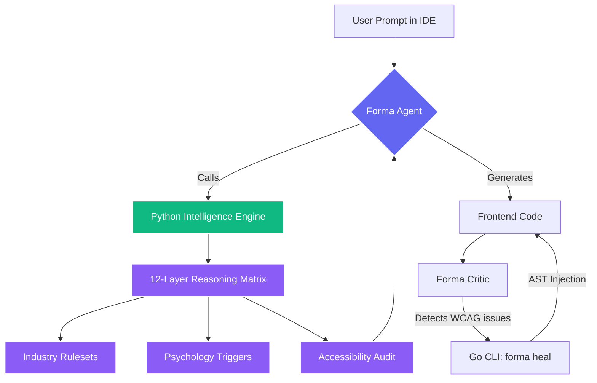
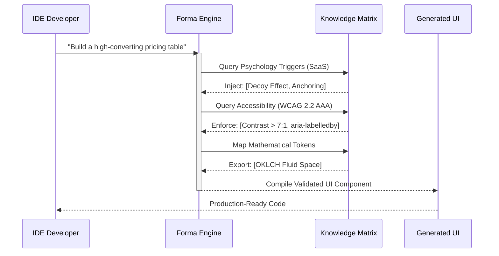

<div align="center">


# 📐 FORMA
**The AI skill that reasons before it designs.**

[](https://github.com/fzihak/forma/actions/workflows/release.yml)
[](https://www.npmjs.com/package/@foysalzihak/forma-cli)
[](https://github.com/fzihak/forma)
[]()
[]()
[](LICENSE)

<br/>

*Forma is an open-source Design Intelligence Framework for AI coding assistants. It replaces basic "generate UI" prompts with an enterprise-grade, multi-agent reasoning architecture.*

</div>

---

## 📑 Table of Contents
- [The Vision](#-the-vision)
- [Core Features](#-core-features)
- [System Architecture](#️-system-architecture)
- [Quick Start](#-quick-start)
- [Usage Examples](#-usage-examples)
- [CLI Reference](#️-cli-reference)
- [Compatibility](#️-compatibility)
- [Security & Privacy](#-security--privacy)
- [Contributing](#-contributing)

---

## ⚡ The Vision

Every AI coding assistant today answers the same question: > *"How should this look?"*

Color palettes. Font pairings. Useful—but fundamentally shallow. Real, industry-grade design requires asking harder questions before a single line of code is written:

- *Who is this for, and what do they actually need?*
- *What does this specific industry strictly forbid?*
- *What cognitive psychology drives this user's decisions?*
- *Will this actually convert?*

**Forma** is built to answer all of them. Automatically. In sequence.

<br/>

## 💎 Core Features

Forma operates at the absolute pinnacle of AI software engineering. It is not just a prompt file—it is a secure, multi-language execution environment powered by Python and Go.

### 🧠 12-Layer Reasoning System
Before any UI is generated, Forma forces your AI through a sequential gauntlet. It analyzes the UX Pre-Flight, queries Industry Intelligence, cross-references Cognitive Psychology, applies Component Best Practices, and performs an Accessibility Audit. Only then does it write code.

### 🩺 AST-Driven Auto-Healer (Zero-Token Healing)
Instead of forcing the AI to waste thousands of tokens rewriting an entire React component just to fix a missing `aria-label`, the Forma Critic agent triggers the Go-based Auto-Healer (`forma heal <file>`). The CLI physically parses your frontend AST and surgically injects missing ARIA labels, alt texts, and SVG properties in **milliseconds**.

### 📐 Mathematical W3C Tokens
Every generated design system is backed by advanced mathematics (OKLCH Color Spaces, Fluid `clamp()` Typography, and Spring Physics) and exported directly into the global W3C Design Token format.

### 🛡️ Graceful Halting
Forma will never catastrophically crash on a developer's machine. The `forma doctor` command instantly diagnoses your environment. If it detects a system failure, it triggers a **Graceful Halt** rather than hallucinating bad code.

<br/>

## 🏗️ System Architecture

Forma is powered by a dual-engine architecture: a high-speed Go CLI that manages system states, and a Python Intelligence Engine that processes complex reasoning matrices.



<br/>

## 🔬 Research & Data Methodology

Forma is built on a foundation of peer-reviewed UX research, mathematical color spaces, and cognitive psychology. It is not an LLM hallucinating designs; it is an LLM querying a strict, deterministic database.

### The Automated Reasoning Sequence
When you prompt your IDE, Forma executes a massive background sequence before writing any code:



### Applied Cognitive Psychology
Forma maps UI component generation directly to established psychological triggers to maximize user retention, trust, and conversion rates.

| Cognitive Trigger | UI Execution Strategy | Primary Industry |
| :--- | :--- | :--- |
| **Hick's Law** | Progressive disclosure & automated layout reduction | SaaS, E-Commerce |
| **Zeigarnik Effect** | Step-based visual progress rings & incomplete states | EdTech, Gamification |
| **Von Restorff Effect** | OKLCH chroma-isolation for primary Call-to-Actions | Fintech, Marketing |
| **Cognitive Load Theory** | Fluid whitespace scaling via Golden Ratio algorithms | Healthcare, Dashboards |

<br/>

## 🚀 Quick Start

**Requirements:** Node.js 18+ · Python 3.9+ · A supported AI assistant

#### 1. Install Globally (NPM)
```bash
npm install -g @foysalzihak/forma-cli
```

#### 2. Inject into your IDE
```bash
forma init --ai claude       # Claude Code
forma init --ai cursor       # Cursor
forma init --ai windsurf     # Windsurf
forma init --ai all          # Install everywhere
```

<br/>

## 💡 Usage Examples

Once installed, Forma operates silently in the background. Just talk to your AI naturally. Forma intercepts the visual requests and applies its reasoning layers.

**Example 1: High-Converting SaaS**
> *"Build a pricing page for our B2B SaaS. Ensure it uses the 'Scarcity' psychology trigger and passes WCAG AAA contrast."*

**Example 2: Industry-Specific Design**
> *"Create a checkout flow for a Fintech app. Forma, check your industry rules for traditional banking before generating."*

**Example 3: Mathematical Redesign**
> *"Refactor this dashboard. Generate a fluid typography scale using `clamp()` and an OKLCH color system."*

<br/>

## 🛠️ CLI Reference

The `forma-cli` binary is lightning fast and handles all environment integrations.

| Command | Description |
| :--- | :--- |
| `forma init` | Interactively configures AI agents and installs Python dependencies (beautifulsoup4, lxml). |
| `forma orchestrate "<prompt>"` | Compiles UX psychology rules and W3C constraints based on user prompt. |
| `forma generate <project> <industry> <mood>` | Runs the Mathematical Engine to generate fluid OKLCH Design Tokens. |
| `forma export --format tailwind` | Compiles the generated W3C tokens into your frontend's `tailwind.config.js`. |
| `forma audit <path>` | Scans UI files using the Critic Engine to grade WCAG, UX, and Visual Hierarchy. |
| `forma heal <file>` | Triggers the AST Auto-Healer to physically inject missing WCAG code. |
| `forma doctor` | Runs a system diagnostic on your Python and Go environments. |
| `forma update` | Instantly upgrades the CLI to the latest Vanguard release from GitHub. |
| `forma remove` | Safely purges Forma agents from your codebase. |

<br/>

## ⚙️ Compatibility

### Supported IDEs / Agents

| Agent Platform | Support | Installation Command |
| :--- | :---: | :--- |
|  | ✅ | `forma init --ai agent` |
|  | ✅ | `forma init --ai augment` |
|  | ✅ | `forma init --ai claude` |
|  | ✅ | `forma init --ai codebuddy` |
|  | ✅ | `forma init --ai codex` |
|  | ✅ | `forma init --ai continue` |
|  | ✅ | `forma init --ai copilot` |
|  | ✅ | `forma init --ai cursor` |
|  | ✅ | `forma init --ai droid` |
|  | ✅ | `forma init --ai gemini` |
|  | ✅ | `forma init --ai kilocode` |
|  | ✅ | `forma init --ai kiro` |
|  | ✅ | `forma init --ai opencode` |
|  | ✅ | `forma init --ai qoder` |
|  | ✅ | `forma init --ai roocode` |
|  | ✅ | `forma init --ai trae` |
|  | ✅ | `forma init --ai warp` |
|  | ✅ | `forma init --ai windsurf` |

<br/>

### Supported Frameworks

Forma is universally adaptable. Just mention your stack in the prompt, or let it intelligently default to HTML + Tailwind CSS.

| Icon | Framework | Domain |
| :---: | :--- | :--- |
|  | **React** | Web UI Library |
|  | **Next.js** | Web Fullstack Framework |
|  | **Vue.js** | Web UI Library |
|  | **Nuxt.js** | Web Fullstack Framework |
|  | **Svelte** | Web Compiler |
|  | **Astro** | Static Site Generator |
|  | **Angular** | Web Framework |
|  | **SolidJS** | Web UI Library |
|  | **Remix** | Web Fullstack Framework |
|  | **Tailwind CSS** | Global Styling System |
|  | **Bootstrap** | CSS Framework |
|  | **Material UI** | Component Library |
|  | **Flutter** | Cross-Platform Mobile |
|  | **React Native** | Cross-Platform Mobile |
|  | **SwiftUI** | iOS Native |
|  | **Jetpack Compose** | Android Native |
|  | **Laravel** | PHP Fullstack Framework |
|  | **Django** | Python Fullstack Framework |
|  | **Ruby on Rails** | Ruby Fullstack Framework |

<br/>

## 🔒 Security & Privacy

Forma is built for Enterprise, which means privacy is non-negotiable.

- **Zero Telemetry**: Forma does not track your usage, collect your prompts, or phone home.
- **Local Execution**: The Go CLI and Python Engine run entirely on your local machine.
- **Sandboxed Agent Logic**: All AI requests are handled exclusively by your IDE's existing LLM connections. Forma acts merely as local context and tooling.

<br/>

## 🧼 Uninstallation

Forma deeply respects your codebase. If you want to remove the AI logic from your project, you don't have to hunt down hidden files.

```bash
# 1. Safely purge all Forma agents from your repository
forma remove

# 2. Uninstall the global binary
npm uninstall -g @foysalzihak/forma-cli
```

<br/>

## 🤝 Contributing

We welcome contributions from the community! Forma is a dual-engine framework built with **Go** (CLI) and **Python** (Intelligence).

```bash
# Clone the repository
git clone https://github.com/fzihak/forma.git
cd forma

# Run the Automated Test Suite
cd forma-cli
go test ./internal/healer/...
python -m unittest ../src/tests/test_engine.py
```

Please see [CONTRIBUTING.md](CONTRIBUTING.md) for full architectural guidelines.

---
<div align="center">
  <p>Built with <b>Go</b>, <b>Python</b>, and <b>Mathematical Neuro-Design</b>.</p>
  <p>MIT License © Foysal Zihak</p>
</div>
